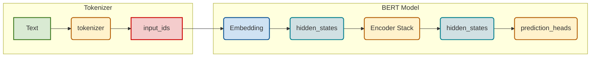
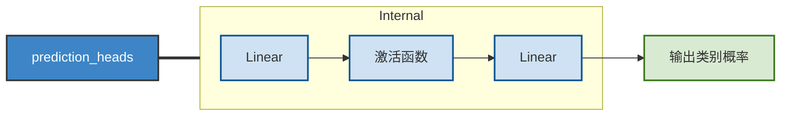
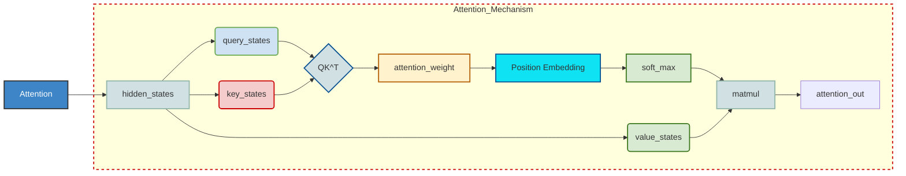
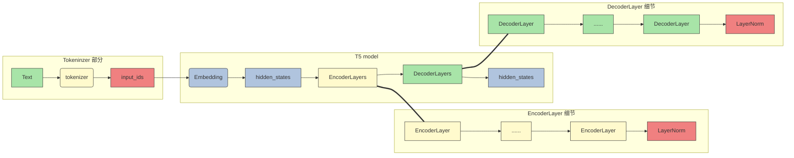

# 预训练语言模型

## Encoder-only

在上一章中，我们深入解析了 **注意力机制（Attention Mechanism）** 以及以此为核心构建的 **Transformer 模型**。Transformer 的提出不仅带来了 NLP 模型架构的彻底革新，也奠定了此后所有预训练语言模型（Pre-trained Language Model, PLM）的基础。
 Transformer 的整体结构由 **Encoder** 与 **Decoder** 两部分组成，两者在结构与输入输出形式上各具特点，也因此衍生出三种不同方向的预训练模型设计思路：

- **Encoder-only**：以 Encoder 为主体，用于自然语言理解（NLU）任务的代表模型是 **BERT**；
- **Decoder-only**：以 Decoder 为核心，适用于自然语言生成（NLG）任务的代表模型是 **GPT 系列**；
- **Encoder-Decoder**：同时保留两部分结构的典型代表是 **T5**。

本章将围绕这三种架构展开，依次介绍 Encoder-only、Encoder-Decoder 和 Decoder-only 模型的核心设计、预训练任务及其在各类 NLP 任务中的优势。

### BERT：双向理解的基石模型

**BERT（Bidirectional Encoder Representations from Transformers）** 是 Google 于 2018 年发布的革命性模型，论文题为《BERT: Pre-training of Deep Bidirectional Transformers for Language Understanding》。
 BERT 在 GLUE、MultiNLI 等多个自然语言理解任务上刷新了当时的最优性能（State-of-the-Art, SOTA），正式确立了“**预训练 + 微调（Pre-training + Fine-tuning）**”的范式。
 自此之后，BERT 成为 NLP 模型设计的基准，并催生了大量衍生与改进模型，如 **RoBERTa**、**MacBERT**、**ALBERT**、**BART** 等。可以说，从 BERT 到 LLM（大型语言模型），是 NLP 领域演进的主线。

#### （1）思想源流：融合 ELMo 与 Transformer

BERT 的提出并非凭空而来，而是融合了两条技术路线的思想：

- **Transformer 架构的继承**
   在 2017 年的论文《Attention Is All You Need》中，Transformer 首次实现了“完全基于注意力机制、摒弃循环与卷积结构”的序列建模方法。BERT 沿用了 Transformer 的 Encoder 结构，并通过多层堆叠与大规模参数扩展，构建了面向理解任务的强大语义建模能力。
- **预训练 + 微调范式的延续**
   2018 年的 ELMo 模型首次引入了“预训练语言模型 + 下游任务微调”的框架，通过双向 LSTM 的语言建模任务获取通用语义表示。BERT 继承了这一思路，但用 Transformer 替代 LSTM，并提出更适合捕捉深层语义的 **掩码语言模型（Masked Language Model, MLM）** 任务，使预训练-微调范式进入黄金时代。

#### （2）模型架构：Encoder-only 的深度语义建模

BERT 的结构完全由 **Transformer Encoder 堆叠而成**，可视为一个去除了 Decoder 的 Seq2Seq 模型。
 在自然语言理解任务中，输入通常是文本序列，输出是分类标签（例如情感分析的“积极/消极”）。
 因此，BERT 在 Encoder 顶层额外增加了一个线性分类头（`prediction_heads`），将隐藏状态映射为类别概率。

整体结构包括：

1. **Tokenizer 部分**：将文本转化为 `input_ids`；
2. **Embedding 层**：将输入 ID 映射到连续向量空间；
3. **Encoder 堆叠层**：核心的多层自注意力与前馈网络；
4. **Prediction Head**：线性层 + 激活函数 + Softmax 输出类别概率。

模型结构示意如下：



>  BERT 使用 **WordPiece** 分词算法，将词语拆解为子词单元（如 “playing” → ["play", "##ing"]）。
>  对于中文文本，每个汉字通常作为独立的 token。

#### （3）Prediction Head：任务适配层

BERT 的分类头通常由两层线性变换和一个激活函数组成，输出维度等于任务的类别数：



------

#### （4）Encoder 层：Attention 与激活函数

每个 Encoder Layer 都由 **多头自注意力（Multi-Head Self-Attention）** 和 **前馈全连接层（Feed Forward Network, FFN）** 组成，并通过残差连接（Residual Connection）与层归一化（LayerNorm）保证训练稳定。

BERT 在 FFN 的激活函数上使用了 **GELU（Gaussian Error Linear Unit）**，公式如下：

$$
 \text{GELU}(x) = 0.5x\left(1 + \tanh\left(\sqrt{\frac{2}{\pi}}(x + 0.044715x^3)\right)\right)
$$

与传统的 ReLU 相比，GELU 具有以下优势：

- **梯度更平滑**：在 0 附近可导，避免 ReLU 的梯度断点问题；
- **分布匹配性强**：输入经 LayerNorm 后近似标准正态分布，GELU 基于正态 CDF 定义，与输入统计特性高度一致；
- **更好的泛化性**：保留部分负值信息，增强模型表达能力与收敛稳定性。

#### （5）注意力机制与相对位置编码

BERT 的注意力机制与 Transformer Encoder 基本一致，唯一差异在于 **引入了可训练的相对位置编码**（在后续改进模型中实现）。
 在计算注意力权重时，BERT 在 ( QK^T ) 得分后加入了可学习的相对位置嵌入，用以增强模型的序列感知能力：



> 需要注意，原始 BERT 使用的是与 Transformer 相同的 **绝对位置编码（sinusoidal encoding）**，而后续如 RoBERTa、DeBERTa 等模型改进为 **相对位置编码**，以增强长距离依赖建模能力。
> 相对位置编码可学习性更强，但也限制了模型的最大输入长度（BERT 约为 512 个 token）。

#### （6）预训练任务 MLM 与 NSP

BERT 真正的突破点在于它提出了两种全新的预训练任务：

- **Masked Language Model（MLM）**：掩码语言模型
- **Next Sentence Prediction（NSP）**：下一句预测任务

这两个任务共同构成了 BERT “理解语言”的核心机制，也奠定了后续所有 Encoder-only 模型（如 RoBERTa、ELECTRA、DeBERTa 等）的预训练思路。

BERT 的预训练遵循 “预训练 + 微调（Pre-train & Fine-tune）” 的两阶段范式。
 其核心思想是：

> 在海量无监督文本上预训练一个具有通用语言理解能力的模型，再针对不同任务用少量标注数据进行微调。

这种思路的关键优势在于：

1. **成本分离**：预训练一次即可服务多个任务；微调开销极低；
2. **大规模学习**：可以直接利用互联网上的海量无监督文本（无需标注）；
3. **任务迁移**：模型经过预训练后，自带“语言常识”，能快速适配不同任务。

传统语言模型（Language Model，LM）通过“**预测下一个词**”的方式在无监督语料上训练，但这种方式只能学习从左到右的单向依赖。而理解自然语言往往需要双向语义（如前后文关联、句法结构、语境推理），这正是 BERT 的创新出发点。

##### 1 Masked Language Model（MLM）

MLM 的核心思想是——让模型在看到上下文的情况下，**预测被遮蔽的词**，类似于人类做“完形填空”的过程：

1. 每个输入序列中随机选取 15% 的 token；
2. 对这 15% 的 token 进行如下处理：
   - 80% 的概率替换为特殊标记 `<MASK>`：允许模型学习上下文信息，并预测出该标记背后的词元。这是最主要的训练任务。
   - 10% 的概率替换为任意其他 token：迫使模型对每个输入词元都保持警觉，学习到“这不是目标词元”的能力。这能减少模型倾向于只关注`[MASK]`标记的情况，防止预训练和微调之间的不一致性。
   - 10% 的概率保持不变：鼓励模型为实际的词元（非`[MASK]`）保留其正确的表示，避免模型认为所有被选中预测的词元都是“错误的”或“需要替换的”，进一步减轻预训练/微调的差异。

设计意图

- **引入随机替换**：防止模型只关注被 `<MASK>` 的位置；
- **保留部分原词**：缓解预训练与微调阶段的输入分布差异；
- **利用上下文预测**：模型需要同时理解上下文的前后信息才能正确预测遮蔽词。

示例

输入句子：

```
I <MASK> you because dog are <MASK>.
```

模型需要预测出：

```
I "love" you because "you" are "kind".
```

##### 2 Next Sentence Prediction（NSP）

MLM 关注的是 **词级（token-level）** 的理解，而在自然语言理解任务（如问答、文本蕴含、句对匹配）中，模型还需要学习 **句级（sentence-level）** 的语义关系。
 因此，BERT 引入了第二个预训练任务，NSP 的目标是：

> 判断两个句子是否在原文中是连续出现的上下文。

训练样本由句子对构成：

| Sentence A  | Sentence B                         | 标签              |
| ----------- | ---------------------------------- | ----------------- |
| I love you. | Because you are wonderful.         | 1（是连续上下文） |
| I love you. | Because today’s dinner is so nice. | 0（非连续上下文） |

数据构造方式

- 正样本（50%）：直接取相邻句子；
- 负样本（50%）：随机取不相邻的句子。

#### （7）微调机制（Fine-tuning）

完成预训练后，BERT 只需在下游任务上进行**轻量级微调**即可达到极高性能：

1. 保留预训练好的 Transformer 层；
2. 在顶部添加一个任务相关的 “prediction head”；
3. 用标注数据继续训练（微调）模型参数。

例如：

- **文本分类任务**
   → 使用 `<CLS>` 向量经过线性层分类；
- **序列标注任务（NER、POS）**
   → 取每个 token 的隐向量输出标注；
- **句对关系任务（NLI、QA）**
   → 取 `<CLS>` 向量做二分类或匹配。

#### 🔧 通用输入结构

```text
[CLS] Sentence A [SEP] Sentence B [SEP]
```

- `[CLS]`：整句（或句对）表示，用于分类任务；
- `[SEP]`：分隔符，用于标记句子边界。


当然可以，下面是我为你**重构、润色并补充可视化的完整版博客文稿**，保持技术严谨性与博客可读性并重，逻辑更连贯、表达更自然，适合作为你的系列 Transformer 文章的下篇。

## Encoder-Decoder

在前文中我们介绍了基于 Encoder-Only 的 BERT 与基于 Decoder-Only 的 GPT。本节将学习另一种重要的结构——Encoder-Decoder（编码器-解码器）。

### T5：Text-To-Text Transfer Transformer

**T5** 是 Google 在 2020 年提出的一种通用语言模型，它将所有 NLP 任务统一表示为“**文本到文本（Text-to-Text）**”的形式。无论是分类、翻译、摘要还是问答，T5 都将其转化为一种输入文本 → 输出文本的映射问题。例如：

- 文本分类任务：
   `输入: classify: 这部电影非常好看`
   `输出: 正面`
- 翻译任务：
   `输入: translate English to German: How are you?`
   `输出: Wie geht es dir?`
- 摘要任务：
   `输入: summarize: BERT 是一种预训练语言模型...`
   `输出: BERT 是一种基于 Transformer 的语言理解模型。`

通过这种统一任务形式，T5 不仅极大简化了模型设计，也提升了参数共享与跨任务迁移能力，真正实现了 NLP 模型的通用化与模块化。

#### （1）模型结构

T5 基于 Transformer 架构，包含Encoder（编码器）和Decoder（解码器）两部分。

- Encoder：负责将输入文本编码为高维语义表示。
- Decoder：在每一步生成时，通过自注意力机制读取前文输出，同时结合 Encoder 编码的语义向量生成下一个 token。



在结构上，T5 继承了 Transformer 的标准设计，包括多头注意力（Multi-Head Attention）与前馈网络（Feed-Forward Network）。但相比原版 Transformer，T5 在以下两点上有所创新：

##### 归一化层改进：RMSNorm 代替 LayerNorm

T5 采用 RMSNorm (Root Mean Square Normalization) 代替了传统的 LayerNorm。

- RMSNorm 公式： RMSNorm 仅基于均方根进行缩放，省略了对输入向量的均值居中操作。

  $$   \text{RMSNorm}(x) = \frac{x}{\sqrt{\frac{1}{n}\sum_{i=1}^{n}x_i^2 + \epsilon}} \cdot \gamma$$

- 优势： 这种归一化方法更轻量、计算更稳定，尤其在大规模训练中能有效减少梯度爆炸的风险，并提升整体训练效率。

##### 位置编码改进：相对位置偏置 (Relative Position Bias)

T5 弃用了绝对位置编码，转而使用相对位置偏置（Relative Position Bias），以增强模型对不同输入长度与上下文跨度的泛化能力。并且T5中相对位置偏置 $B_{ij}$ 不加到输入上，而是直接加到 Transformer 的自注意力机制的得分上：

$$A'_{ij} = Q_i K_j^T + B_{ij}$$

其中：

- $Q_i$ 和 $K_j$ 分别是查询和键向量的点积得分。
- $B_{ij}$ 是表示词元 $i$ 和词元 $j$ 之间相对距离 $|i - j|$ 的可学习偏置项。

距离分桶机制（Distance Bucketing）：T5 的核心创新在于如何高效地学习这些相对位置偏置$B_{ij}$。它采用分桶机制将无限多的相对距离映射到有限数量的可学习参数上。

首先，模型区分正向距离（$j > i$）和负向距离（$j < i$），为它们分配不同的参数空间，以保留序列的方向信息。

其次，对于相对距离 $d = |i - j|$，T5 使用一个分段函数将其映射到桶索引 $\text{bucket\_id}(d)$：

1. 独立近距离桶： 对于小于某个阈值 $k$ 的距离（例如 $k=8$ 或 $12$），每个距离 $d$ 都有自己的独立桶。这保证了对局部语义关系的高分辨率建模。

   $$\text{bucket\_id}(d) = d \quad \text{if } d < k$$

2. 对数远距离桶： 对于大于或等于 $k$ 的距离，T5 使用近似对数函数进行映射，使得距离越远，增长越慢，越多的距离共享同一个桶。

   $$\text{bucket\_id}(d) = k + \lfloor \ln(d/k) / \ln(1.02) \rfloor \quad \text{if } d \ge k$$

最后，T5中所有的偏置项 $B_{ij}$ 是从一个共享的、有限大小的偏置矩阵中根据计算出的 $\text{bucket\_id}(|i-j|)$ 查找出来的可学习参数。

#### （2）预训练任务

与 BERT 类似，T5 的预训练目标本质上也是一种掩码语言模型（MLM）。但它并非简单地随机遮蔽单个 token，而是采用更自然的“**Span Corruption（片段遮蔽）**”策略。

预训练流程

1. 从语料中随机选择若干个**连续的 token 片段（Span）**；
2. 将每个片段替换为一个特殊占位符（如 `<extra_id_0>`、`<extra_id_1>`）；
3. 模型输入为被遮蔽的句子，输出为被替换掉的 token 序列。

例如：

输入：

```
The <extra_id_0> walked to the <extra_id_1>.
```

输出：

```
<extra_id_0> man <extra_id_1> store.
```

这种方式比 BERT 的随机 token 遮蔽更接近人类语言处理方式，使模型学会预测更长跨度的语义单元，从而捕捉上下文的整体结构。

#### （3）多任务预训练与迁移学习

T5 在预训练阶段不仅学习 MLM，还融合了多种任务（如翻译、摘要、问答等）的统一训练。这种**多任务预训练（Multi-Task Pretraining）**使得模型能学习到跨任务的共享语言表示，从而在下游任务中具备更强的迁移能力。

预训练完成后，T5 可以通过简单的微调快速适配各种任务，只需在输入前加上任务前缀（Task Prefix）即可：

| 任务类型 | 输入格式                                    | 输出                                           |
| -------- | ------------------------------------------- | ---------------------------------------------- |
| 文本分类 | `classify: 这是一部好电影`                  | `正面`                                         |
| 翻译     | `translate English to German: How are you?` | `Wie geht es dir?`                             |
| 摘要     | `summarize: BERT 是一种预训练语言模型...`   | `BERT 是一种基于 Transformer 的语言理解模型。` |

#### （4）大一统思想：统一视角下的 NLP 世界

T5 最具革命性的创新在于其提出的 **NLP 大一统思想**：

> 所有自然语言处理任务，归根结底都是“输入一段文本 → 输出一段文本”的过程。

这种理念的意义在于：

1. **统一任务形式**：所有任务都可通过相同模型架构完成；
2. **统一输入输出接口**：训练、推理、微调完全复用；
3. **统一优化目标**：跨任务共享语言理解能力；
4. **显著简化开发流程**：从工程角度提升 NLP 系统的复用性。

T5 通过这种统一的“文本到文本”视角，不仅使模型具备了更强的通用性与可扩展性，也为后续的多模态模型（如 Flamingo、PaLM-E 等）提供了设计启发。

## Decoder-Only

在前两节中，我们分别讲解了由 Transformer 发展而来的两种模型架构——以 BERT 为代表的 Encoder-Only 模型和以 T5 为代表的 Encoder-Decoder 模型。那么，很自然可以想见，除了上述两种架构，还可以有一种模型架构——Decoder-Only，即只使用 Decoder 堆叠而成的模型。

事实上，Decoder-Only 就是目前大火的 LLM 的基础架构，目前所有的 LLM 基本都是 Decoder-Only 模型（RWKV、Mamba 等非 Transformer 架构除外）。而引发 LLM 热潮的 ChatGPT，正是 Decoder-Only 系列的代表模型 GPT 系列模型的大成之作。而目前作为开源 LLM 基本架构的 LLaMA 模型，也正是在 GPT 的模型架构基础上优化发展而来。因此，在本节中，我们不但会详细分析 Decoder-Only 代表模型 GPT 的原理、架构和特点，还会深入到目前的主流开源 LLM，分析它们的结构、特点，结合之前对 Transformer 系列其他模型的分析，帮助大家深入理解当下被寄予厚望、被认为是 AGI 必经之路的 LLM 是如何一步步从传统 PLM 中发展而来的。

### GPT

GPT，即 Generative Pre-Training Language Model，是由 OpenAI 团队于 2018年发布的预训练语言模型。虽然学界普遍认可 BERT 作为预训练语言模型时代的代表，但首先明确提出预训练-微调思想的模型其实是 GPT。GPT 提出了通用预训练的概念，也就是在海量无监督语料上预训练，进而在每个特定任务上进行微调，从而实现这些任务的巨大收益。虽然在发布之初，由于性能略输于不久后发布的 BERT，没能取得轰动性成果，也没能让 GPT 所使用的 Decoder-Only 架构成为学界研究的主流，但 OpenAI 团队坚定地选择了不断扩大预训练数据、增加模型参数，在 GPT 架构上不断优化，最终在 2020年发布的 GPT-3 成就了 LLM 时代的基础，并以 GPT-3 为基座模型的 ChatGPT 成功打开新时代的大门，成为 LLM 时代的最强竞争者也是目前的最大赢家。

本节将以 GPT 为例，分别从模型架构、预训练任务、GPT 系列模型的发展历程等三个方面深入分析 GPT 及其代表的 Decoder-Only 模型，并进一步引出当前的主流 LLM 架构——LLaMA。

#### （1） 模型架构


如图可以看到，GPT 的整体结构和 BERT 是有一些类似的，只是相较于 BERT 的 Encoder，选择使用了 Decoder 来进行模型结构的堆叠。由于 Decoder-Only 结构也天生适用于文本生成任务，所以相较于更贴合 NLU 任务设计的 BERT，GPT 和 T5 的模型设计更契合于 NLG 任务和 Seq2Seq 任务。同样，对于一个自然语言文本的输入，先通过 tokenizer 进行分词并转化为对应词典序号的 input_ids。

输入的 input_ids 首先通过 Embedding 层，再经过 Positional Embedding 进行位置编码，位置编码也是可学习的。

通过 Embedding 层和 Positional Embedding 层编码成 hidden_states 之后，就可以进入到解码器（Decoder），第一代 GPT 模型和原始 Transformer 模型类似，选择了 12层解码器层，但是在解码器层的内部，相较于 Transformer 原始 Decoder 层的双注意力层设计，GPT 的 Decoder 层反而更像 Encoder 层一点。由于不再有 Encoder 的编码输入，Decoder 层仅保留了一个带掩码的注意力层，并且将 LayerNorm 层从 Transformer 的注意力层之后提到了注意力层之前。hidden_states 输入 Decoder 层之后，会先进行 LayerNorm，再进行掩码注意力计算，然后经过残差连接和再一次 LayerNorm 进入到 MLP 中并得到最后输出。

由于不存在 Encoder 的编码结果，Decoder 层中的掩码注意力也是自注意力计算。也就是对一个输入的 hidden_states，会通过三个参数矩阵来生成 query、key 和 value，而不再是像 Transformer 中的 Decoder 那样由 Encoder 输出作为 key 和 value。后续的注意力计算过程则和 BERT 类似，只是在计算得到注意力权重之后，通过掩码矩阵来遮蔽了未来 token 的注意力权重，从而限制每一个 token 只能关注到它之前 token 的注意力，来实现掩码自注意力的计算。

另外一个结构上的区别在于，GPT 的 MLP 层没有选择线性矩阵来进行特征提取，而是选择了两个一维卷积核来提取，不过，从效果上说这两者是没有太大区别的。通过 N 个 Decoder 层后的 hidden_states 最后经过线性矩阵映射到词表维度，就可以转化成自然语言的 token，从而生成我们的目标序列。

#### （2）预训练任务

Decoder-Only 的模型结构往往更适合于文本生成任务，因此，Decoder-Only 模型往往选择了最传统也最直接的预训练任务——因果语言模型，Casual Language Model，下简称 CLM。

CLM 可以看作 N-gram 语言模型的一个直接扩展。N-gram 语言模型是基于前 N 个 token 来预测下一个 token，CLM 则是基于一个自然语言序列的前面所有 token 来预测下一个 token，通过不断重复该过程来实现目标文本序列的生成。也就是说，CLM 是一个经典的补全形式。例如，CLM 的输入和输出可以是：

    input: 今天天气
    output: 今天天气很
    
    input: 今天天气很
    output：今天天气很好

因此，对于一个输入目标序列长度为 256，期待输出序列长度为 256 的任务，模型会不断根据前 256 个 token、257个 token（输入+预测出来的第一个 token）...... 进行 256 次计算，最后生成一个序列长度为 512 的输出文本，这个输出文本前 256 个 token 为输入，后 256 个 token 就是我们期待的模型输出。

在前面我们说过，BERT 之所以可以采用预训练+微调的范式取得重大突破，正是因为其选择的 MLM、NSP 可以在海量无监督语料上直接训练——而很明显，CLM 是更直接的预训练任务，其天生和人类书写自然语言文本的习惯相契合，也和下游任务直接匹配，相对于 MLM 任务更加直接，可以在任何自然语言文本上直接应用。因此，CLM 也可以使用海量的自然语言语料进行大规模的预训练，无需任何人工标注数据。

#### （3）GPT 系列模型的发展

自 GPT-1 推出开始，OpenAI 一直坚信 Decoder-Only 的模型结构和“体量即正义”的优化思路，不断扩大预训练数据集、模型体量并对模型做出一些小的优化和修正，来不断探索更强大的预训练模型。从被 BERT 压制的 GPT-1，到没有引起足够关注的 GPT-2，再到激发了涌现能力、带来大模型时代的 GPT-3，最后带来了跨时代的 ChatGPT，OpenAI 通过数十年的努力证明了其思路的正确性。

下表总结了从 GPT-1 到 GPT-3 的模型结构、预训练语料大小的变化：

模型 | Decoder Layer | Hidden_size | 注意力头数 | 注意力维度 | 总参数量 | 预训练语料 
---- | --------------|------------|------------|----------|----------|----------
GPT-1|12|3072|12|768|0.12B|5GB
GPT-2|48|6400|25|1600|1.5B|40GB
GPT-3|96|49152|96|12288|175B|570GB

GPT-1 是 GPT 系列的开山之作，也是第一个使用 Decoder-Only 的预训练模型。但是，GPT-1 的模型体量和预训练数据都较少，沿承了传统 Transformer 的模型结构，使用了 12层 Decoder Block 和 768 的隐藏层维度，模型参数量仅有 1.17亿（0.12B），在大小为 5GB 的 BooksCorpus 数据集上预训练得到。可以看到，GPT-1 的参数规模与预训练规模和 BERT-base 是大致相当的，但其表现相较于 BERT-base 却有所不如，这也是 GPT 系列模型没能成为预训练语言模型时代的代表的原因。

GPT-2 则是 OpenAI 在 GPT-1 的基础上进一步探究预训练语言模型多任务学习能力的产物。GPT-2 的模型结构和 GPT-1 大致相当，只是扩大了模型参数规模、将 Post-Norm 改为了 Pre-Norm（也就是先进行 LayerNorm 计算，再进入注意力层计算）。这些改动的核心原因在于，由于模型层数增加、体量增大，梯度消失和爆炸的风险也不断增加，为了使模型梯度更稳定对上述结构进行了优化。

GPT-2 的核心改进是大幅增加了预训练数据集和模型体量。GPT-2 的 Decoder Block 层数达到了48（注意，GPT-2 共发布了四种规格的模型，此处我们仅指规格最大的 GPT-2 模型），隐藏层维度达到了 1600，模型整体参数量达 15亿（1.5B），使用了自己抓取的 40GB 大小的 WebText 数据集进行预训练，不管是模型结构还是预训练大小都超过了 1代一个数量级。

GPT-2 的另一个重大突破是以 zero-shot（零样本学习）为主要目标，也就是不对模型进行微调，直接要求模型解决任务。例如，在传统的预训练-微调范式中，我们要解决一个问题，一般需要收集几百上千的训练样本，在这些训练样本上微调预训练语言模型来实现该问题的解决。而 zero-shot 则强调不使用任何训练样本，直接通过向预训练语言模型描述问题来去解决该问题。zero-shot 的思路自然是比预训练-微调范式更进一步、更高效的自然语言范式，但是在 GPT-2 的时代，模型能力还不足够支撑较好的 zero-shot 效果，在大模型时代，zero-shot 及其延伸出的 few-shot（少样本学习）才开始逐渐成为主流。

GPT-3 则是更进一步展示了 OpenAI“力大砖飞”的核心思路，也是 LLM 的开创之作。在 GPT-2 的基础上，OpenAI 进一步增大了模型体量和预训练数据量，整体参数量达 175B，是当之无愧的“大型语言模型”。在模型结构上，基本没有大的改进，只是由于巨大的模型体量使用了稀疏注意力机制来取代传统的注意力机制。在预训练数据上，则是分别从 CC、WebText、维基百科等大型语料集中采样，共采样了 45T、清洗后 570GB 的数据。根据推算，GPT-3 需要在 1024张 A100（80GB 显存）的分布式训练集群上训练 1个月。

之所以说 GPT-3 是 LLM 的开创之作，除去其巨大的体量带来了涌现能力的凸显外，还在于其提出了 few-shot 的重要思想。few-shot 是在 zero-shot 上的改进，研究者发现即使是 175B 大小的 GPT-3，想要在 zero-shot 上取得较好的表现仍然是一件较为困难的事情。而 few-shot 是对 zero-shot 的一个折中，旨在提供给模型少样的示例来教会它完成任务。few-shot 一般会在 prompt（也就是模型的输入）中增加 3~5个示例，来帮助模型理解。例如，对于情感分类任务：

    zero-shot：请你判断‘这真是一个绝佳的机会’的情感是正向还是负向，如果是正向，输出1；否则输出0
    
    few-shot：请你判断‘这真是一个绝佳的机会’的情感是正向还是负向，如果是正向，输出1；否则输出0。你可以参考以下示例来判断：‘你的表现非常好’——1；‘太糟糕了’——0；‘真是一个好主意’——1。

通过给模型提供少量示例，模型可以取得远好于 zero-shot 的良好表现。few-shot 也被称为上下文学习（In-context Learning），即让模型从提供的上下文中的示例里学习问题的解决方法。GPT-3 在 few-shot 上展现的强大能力，为 NLP 的突破带来了重要进展。如果对于绝大部分任务都可以通过人为构造 3~5个示例就能让模型解决，其效率将远高于传统的预训练-微调范式，意味着 NLP 的进一步落地应用成为可能——而这，也正是 LLM 的核心优势。

在 GPT 系列模型的基础上，通过引入预训练-指令微调-人类反馈强化学习的三阶段训练，OpenAI 发布了跨时代的 ChatGPT，引发了大模型的热潮。也正是在 GPT-3 及 ChatGPT 的基础上，LLaMA、ChatGLM 等模型的发布进一步揭示了 LLM 的无尽潜力。在下一节，我们将深入剖析目前 LLM 的普适架构——LLaMA。

### LLaMA

LLaMA模型是由Meta（前Facebook）开发的一系列大型预训练语言模型。从LLaMA-1到LLaMA-3，LLaMA系列模型展示了大规模预训练语言模型的演进及其在实际应用中的显著潜力。

#### （1） 模型架构

与GPT系列模型一样，LLaMA模型也是基于Decoder-Only架构的预训练语言模型。LLaMA模型的整体结构与GPT系列模型类似，只是在模型规模和预训练数据集上有所不同。如图是LLaMA模型的架构示意图：


总体流程：

1. 输入文本 → tokenizer → `input_ids`（可能带 `attention_mask`、特殊 token）。
2. `input_ids` → token embedding（得到初始 `hidden_states`）。
3. 把 `hidden_states` 输入到 N 层 **decoder block**（每层包含：RMSNorm → masked self-attention（含 RoPE） → 残差 → RMSNorm → Gated-MLP → 残差）。
4. 堆叠 N 层后做最终归一化（RMSNorm），再通过线性投影到词表维得到 logits（通常与 embedding 权重共享）。
5. 生成阶段使用 causal mask + KV cache（历史 K/V 的增量拼接）完成高效自回归推断。

##### 1. Tokenizer 与 Embedding

- 功能：将文本分割并映射为离散 `input_ids`，embedding 将 id 映射为向量（维度 `d_model`）。
- 与 Transformer/GPT 的差别：这一块通常一致；差别主要在后续如何编码位置信息（见 RoPE）。

##### 2. 位置编码：RoPE（Rotary Positional Embeddings）

- LLaMA 采用：RoPE，把位置编码作为对 Q/K 的旋转变换（在 attention 计算前作用于 Q 与 K）。
- 经典 Transformer（原论文）：使用可加的绝对位置编码（sinusoidal pos emb）或可学习的位置向量相加到 token embedding。
- 早期 GPT（如 GPT-2/GPT-3 的一些实现）：通常采用可学习的绝对位置 embedding（加到 token embedding）。
- 为什么用 RoPE？优点：
  - 能直接在内积中体现相对位置信息，更自然地支持相对位置感知。
  - 对长序列推断/外推（extrapolation）更友好：在某些实现上，RoPE 能较好地处理超出训练长度的序列。
  - 与 attention 内部（Q·K）耦合紧密，避免将位置信息作为简单的偏置叠加。

##### 3. 归一化：RMSNorm（Pre-norm）

- LLaMA 使用：RMSNorm（Root Mean Square Normalization），并采用 pre-norm 架构（即先归一化再做子层计算）。
- 原始 Transformer：使用 LayerNorm（有均值与方差归一化，通常在子层后/前的版本存在差别）。
- 为什么用 RMSNorm（优点）：
  - RMSNorm 没有减去均值项（没有 centering），计算更简洁，且在大模型训练中表现良好。
  - 与 pre-norm 配合能提高训练稳定性、梯度流通畅，尤其在大深度（很多层）模型里更易收敛

##### 4. Self-Attention（Masked，自回归）

- 功能流程：
  1. `hidden_states` → 线性映射得到 Q, K, V。
  2. 对 Q/K 应用 RoPE（位置编码）。
  3. 计算 scaled dot-product：`scores = Q·K^T / sqrt(d_k)`。
  4. 应用 mask（causal mask + padding mask），对被屏蔽位置施加 −inf 后 softmax。
  5. `attention_out = softmax(scores) · V`。

##### 5. Feed-Forward（MLP）

- 结构（常见实现）：
  - `gate = W_g x`，`up = W_u x`。
  - `activated = act(gate)`（如 SiLU / GELU 变体）。
  - `mid = activated * up`（逐元素相乘，门控机制）。
  - `out = W_down(mid)`（降回 `d_model`）。
- 为什么用 Gated FFN（优点）：
  - 门控结构（SwiGLU）在表达能力上优于简单的两层 MLP（提升非线性建模能力）且能提高参数利用效率。
  - 在同等参数预算下通常有更好的下游性能和训练速度。

#### （2） LLaMA模型的发展历程

**LLaMA-1 系列**：

- Meta于2023年2月发布了LLaMA-1，包括7B、13B、30B和65B四个参数量版本。
- 这些模型在超过1T token的语料上进行了预训练，其中最大的65B参数模型在2,048张A100 80G GPU上训练了近21天。
- LLaMA-1因其开源性和优异性能迅速成为开源社区中最受欢迎的大模型之一。

**LLaMA-2 系列**：

- 2023年7月，Meta发布了LLaMA-2，包含7B、13B、34B和70B四个参数量版本，除了34B模型外，其他均已开源。
- LLaMA-2将预训练的语料扩充到了2T token，并将模型的上下文长度从2,048翻倍到了4,096。
- 引入了分组查询注意力机制（Grouped-Query Attention, GQA）等技术。

**LLaMA-3 系列**：

- 2024年4月，Meta发布了LLaMA-3，包括8B和70B两个参数量版本，同时透露400B的LLaMA-3还在训练中。
- LLaMA-3支持8K长文本，并采用了编码效率更高的tokenizer，词表大小为128K。
- 使用了超过15T token的预训练语料，是LLaMA-2的7倍多。

LLaMA模型以其技术创新、多参数版本、大规模预训练和高效架构设计而著称。模型支持从7亿到数百亿不等的参数量，适应不同规模的应用需求。LLaMA-1以其开源性和优异性能迅速受到社区欢迎，而LLaMA-2和LLaMA-3进一步通过引入分组查询注意力机制和支持更长文本输入，显著提升了模型性能和应用范围。特别是LLaMA-3，通过采用128K词表大小的高效tokenizer和15T token的庞大训练数据，实现了在多语言和多任务处理上的重大进步。Meta对模型安全性和社区支持的持续关注，预示着LLaMA将继续作为AI技术发展的重要推动力，促进全球范围内的技术应用和创新。
